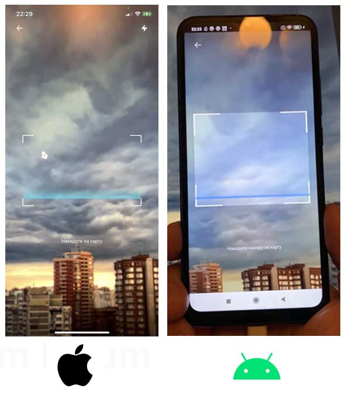
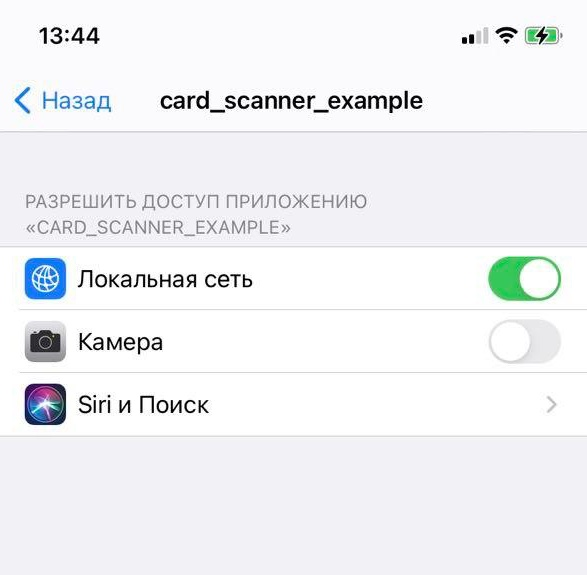

# Credit card scanner for Flutter
<p align="center">
    
</p>

Card scanning plugin.

This package forked from 
[nateshmbhat/card-scanner-flutter](https://github.com/nateshmbhat/card-scanner-flutter) and made some changes.

### Platform supports
---

- The minimum target for `Android` should be >= 5.0 
- The minimum target for `iOS` should be >= 13.0

### Environments:
---

- dart 2.14.4
- flutter 2.5.3
- null safety

### Installing
---
Add to pubspec.yaml

```
dependencies:
  card_scanner:
    git:
      url: https://github.com/yauheniprakapenka/card_scanner.git
      ref: 5fef7e1 # v0.3.1
```
---

Import the package:

```dart
import 'package:card_scanner/card_scanner.dart';
```

Call card scanner:
```dart
const scanOptions = ScanOptions(scanCardHolderName: true);
final receivedCard = await CardScanner.scanCard(scanOptions: scanOptions);
print(receivedCard);
```

### Example output
---

```dart
number: 2412751234123456
cardholder: LEE M. CARDHOLDER
expiry:
```

### Permission handling
---

If `iOS` app not allowed to use the camera

<p align="center">
    
</p>

then an exception will be sent:

```dart
Future<void> _scanCard() async {
    const scanOptions = ScanOptions(scanCardHolderName: true);
    try {
      final receivedCard = await CardScanner.scanCard(scanOptions: scanOptions);
      if (receivedCard == null) return;
      if (!mounted) return;
      card = receivedCard;
      setState(() {});
    } catch (e) {
      debugPrint(e.toString());
      // Example catched error:
      //
      // PlatformException
      // code: "camera_access_denied", 
      // message: "No permission for the camera. Turn on permission in app settings"
  }
```


### Entities
---

- `CardScanner` 
- `ScannedCardModel`
- `ScanOptions`
- `CardHolderPosition`

### Example
---

```dart
import 'package:card_scanner/card_scanner.dart';
import 'package:flutter/material.dart';

void main() {
  runApp(const MyApp());
}

class MyApp extends StatelessWidget {
  const MyApp({Key? key}) : super(key: key);

  @override
  Widget build(BuildContext context) {
    return MaterialApp(
      theme: ThemeData(primarySwatch: Colors.blue),
      home: const MyHomePage(),
    );
  }
}

class MyHomePage extends StatefulWidget {
  const MyHomePage({Key? key}) : super(key: key);

  @override
  State<MyHomePage> createState() => _MyHomePageState();
}

class _MyHomePageState extends State<MyHomePage> {
  var card = ScannedCardModel();

  @override
  Widget build(BuildContext context) {
    return Scaffold(
      appBar: AppBar(title: const Text('Flutter App')),
      body: Center(
        child: Column(
          mainAxisAlignment: MainAxisAlignment.center,
          children: [
            Text(card.toString()),
            _buildButton(),
          ],
        ),
      ),
    );
  }

  Widget _buildButton() {
    return ElevatedButton(
      onPressed: () async {
        await _scanCard();
      },
      child: const Text('Scan card'),
    );
  }

  Future<void> _scanCard() async {
    const scanOptions = ScanOptions(scanCardHolderName: true);
    try {
      final receivedCard = await CardScanner.scanCard(scanOptions: scanOptions);
      if (receivedCard == null) return;
      if (!mounted) return;
      card = receivedCard;
      setState(() {});
    } catch (e) {
      debugPrint(e.toString());
    }
  }
}

```
